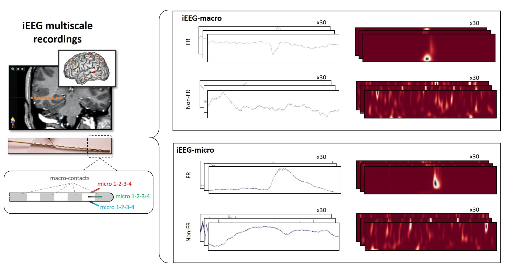
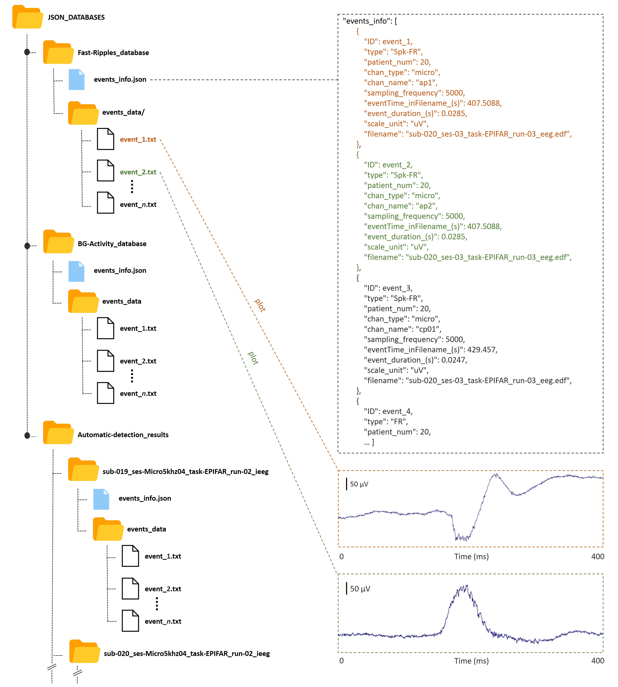

# Description
This program partly presents the processing performed by Ladybird, a tool for automatic detection of fast-ripples (FRs) in epilepsy.

The objective is to allow users to understand the deep-learning component of our detection procedure, which is a major step. User can use his own data or use the data we provide on this page.

The model is a convolutional neural network (CNN) trained to recognise scalograms of 400 ms portions of EEG activity containing or not containing an FR. It can be adapted to macro-EEG or micro-EEG data (demo here: https://github.com/LudovicGardy/Ladybird_short_shared/blob/master/program/start_demo.ipynb).

The user provides a 400 ms time series and the sampling rate as input. The algorithm will perform the following steps:

- Standardize the raw signal
- Pre-whiten the standardized raw signal [ref. 1],
- Generate the continuous wavelet scalogram (CWT, [ref. 2]),
- Whiten the scalogram (ZH0 normalization, see [ref. 3, ref. 4]),
- Apply a two-dimensional convolution to the whitened scalogram (see an example from a previous study on epileptic spikes in ref. 5).
- Submit the final scalogram (50x500 pixels) to the CNN for classification as FR or nonFR.

Please, open the _**`main.ipynb`**_ file, either using this Github page or a jupyter notebook.

# Some information about the dataset
Data were recorded from drug-resistant epilepsy patients implanted with deep intracerebral hybrid electrodes (see Figure 1). They are anonymised and represent only a small fraction of the available records. Each selected event was reviewed by at least two users: a neurologist (J. Curot, MD, PhD) and a neuroscientist (L.Gardy, PhD or E. Despouy, PhD. Also with E.J. Barbeau, PhD and C. Hurter, PhD).



We also propose some simulated data to validate our procedure with a known frequency, duration and position. The provided database is structured as shown in Figure 2.



# Normalization process
Before feeding the CNN, EEG raw data and scalograms are normalized through different methods. Figure 3 shows an example of this process. On this figure, the y axis of scalograms are represtend between 10 and 600 Hz.


# Requirements
Listed in "_**requirements.txt**_".

```
> pip install -r requirements.txt
```

# References
[1] Roehri, N., Pizzo, F., Bartolomei, F., Wendling, F., & Bénar, C. G. (2017a). What are the assets and weaknesses of HFO detectors? A benchmark framework based on realistic simulations. PLoS ONE, 12(4). https://doi.org/10.1371/journal.pone.0174702

[2] Cohen M.X. Analyzing Neural Time Series Data: Theory and Practice, Cambridge, MA, USA:MIT Press, 2014.

[3] Roehri, N., & G, B. C. (2017b). A New Hope for HFO representation: the ZH0 time-frequency normalization Modeling variability of brain electrical activity View project Characterizing and modeling the neurovascular coupling for interictal spikes View project A New Hope for HFO representation: the ZH0 time-frequency normalization. Journal of Neuroscience Methods, 130(9), 118–126. https://doi.org/10.13140/RG.2.2.19375.74406

[4] Roehri, N., Lina, J.-M., Mosher, J. C., Bartolomei, F., and Benar, C.-G. (2016). Time-frequency strategies for increasing high-frequency oscillation detectability in intracerebral eeg. IEEE Transactions on Biomedical Engineering, 63(12):2595–2606. https://doi.org/10.1109/TBME.2016.2556425

[5] Gardy L., Barbeau E.J., Hurter C. Automatic Detection of Epileptic Spikes in Intracerebral EEG with Convolutional Kernel Density Estimation. Proceedings of the 15th International Joint Conference on Computer Vision, Imaging and Computer Graphics Theory and Applications - Volume 2 : HUCAPP, pages 101-109, 2020. https://doi.org/10.5220/0008877601010109
