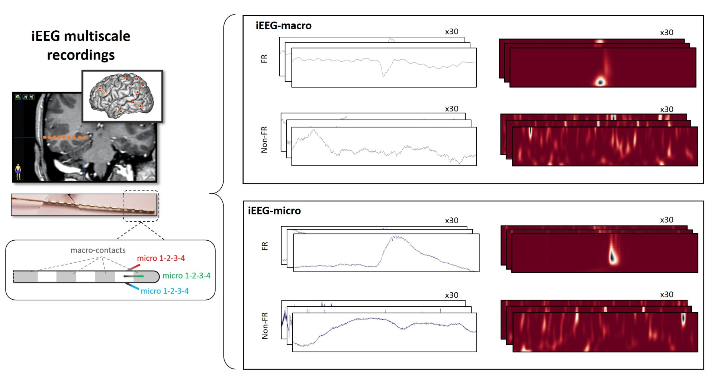
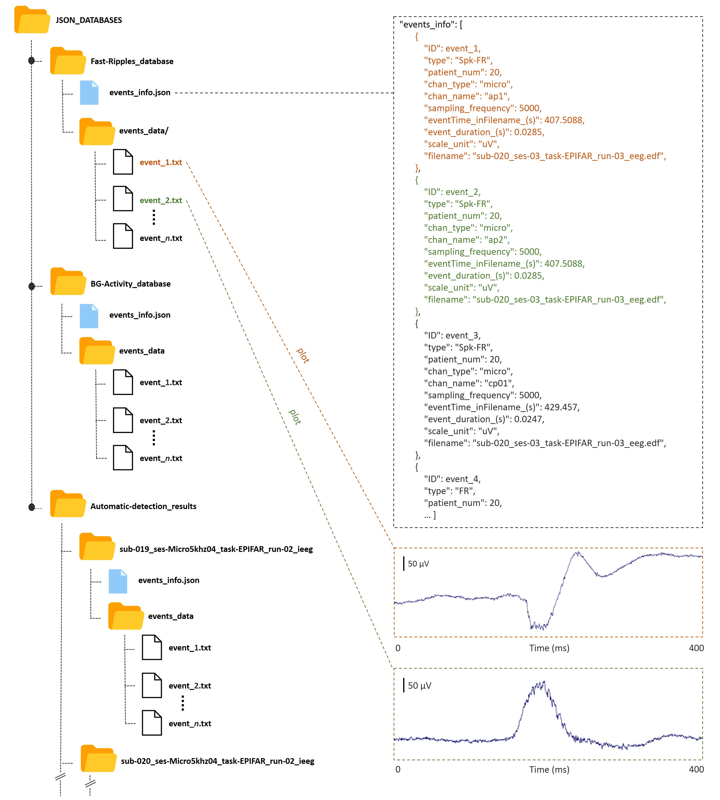
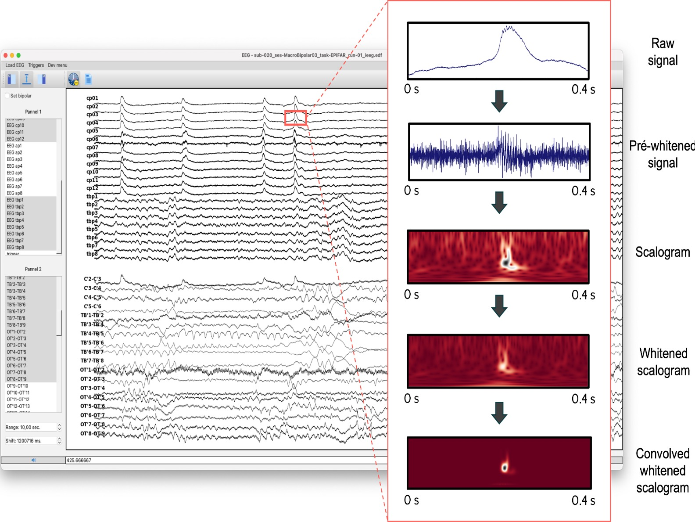

# Halyzia© / Ladybird Neural Network

## Description
Halyzia©, also known as Ladybird, is a sophisticated software designed for the automatic detection of fast-ripples (FRs) in epilepsy, as described in the [doctoral thesis of L. Gardy](http://thesesups.ups-tlse.fr/5164/1/2021TOU30190.pdf) and patented under [Brevet: FR3128111](https://data.inpi.fr/brevets/FR3128111). This repository showcases a component of Halyzia© that is focused on the efficient automatic detection of Fast Ripples (FR) in epilepsy.

A convolutional neural network (CNN) was trained to recognize scalograms of 400 ms segments of EEG activity that either contain or do not contain an FR. It can adapt to macro-EEG and micro-EEG data. The algorithm performs the following steps:

- Standardize the raw signal.
- Pre-whiten the standardized raw signal [ref. 1].
- Generate the continuous wavelet scalogram (CWT, [ref. 2]).
- Whiten the scalogram (ZH0 normalization, see [ref. 3, ref. 4]).
- Apply a two-dimensional convolution to the whitened scalogram (see an example from a previous study on epileptic spikes in ref. 5).
- Submit the final scalogram (50x500 pixels) to the CNN for classification as FR or non-FR.
- Filters false positives using a homemade algorithm consisting of multiple clustering and probabilistic steps.

Please open the `main.ipynb` file using either this GitHub page or a Jupyter Notebook.

## Installation

### Prerequisites
- Python 3.11
- Python libraries: see requirements.txt

## Usage

### Input data
Data were recorded from drug-resistant epilepsy patients implanted with deep intracerebral hybrid electrodes (see Figure 1). They are anonymized and represent only a small fraction of the available records. Each selected event was reviewed by at least two users: a neurologist (J. Curot, MD, PhD) and a neuroscientist (L. Gardy, PhD or E. Despouy, PhD, with E.J. Barbeau, PhD and C. Hurter, PhD).

We also provide some simulated data to validate our procedure with a known frequency, duration, and position. The provided database is structured as shown in Figure 2.

### Normalization process
Before feeding the CNN, EEG raw data and scalograms are normalized through different methods. Figure 3 shows an example of this process. On this figure, the y-axis of scalograms is represented between 10 and 600 Hz.

## References
[1] Roehri, N., Pizzo, F., Bartolomei, F., Wendling, F., & Bénar, C. G. (2017a). What are the assets and weaknesses of HFO detectors? A benchmark framework based on realistic simulations. PLoS ONE, 12(4). https://doi.org/10.1371/journal.pone.0174702

[2] Cohen M.X. Analyzing Neural Time Series Data: Theory and Practice, Cambridge, MA, USA:MIT Press, 2014.

[3] Roehri, N., & G, B. C. (2017b). A New Hope for HFO representation: the ZH0 time-frequency normalization Modeling variability of brain electrical activity View project Characterizing and modeling the neurovascular coupling for interictal spikes View project A New Hope for HFO representation: the ZH0 time-frequency normalization. Journal of Neuroscience Methods, 130(9), 118–126. https://doi.org/10.13140/RG.2.2.19375.74406

[4] Roehri, N., Lina, J.-M., Mosher, J. C., Bartolomei, F., and Benar, C.-G. (2016). Time-frequency strategies for increasing high-frequency oscillation detectability in intracerebral eeg. IEEE Transactions on Biomedical Engineering, 63(12):2595–2606. https://doi.org/10.1109/TBME.2016.2556425

[5] Gardy L., Barbeau E.J., Hurter C. Automatic Detection of Epileptic Spikes in Intracerebral EEG with Convolutional Kernel Density Estimation. Proceedings of the 15th International Joint Conference on Computer Vision, Imaging and Computer Graphics Theory and Applications - Volume 2 : HUCAPP, pages 101-109, 2020. https://doi.org/10.5220/0008877601010109

## Author
- LinkedIn: [Ludovic Gardy](https://www.linkedin.com/in/ludovic-gardy/)
- Doctoral thesis: [PDF](http://thesesups.ups-tlse.fr/5164/1/2021TOU30190.pdf)

## Note
For patent reasons, access to the code is restricted. Please contact the author for more information at [ludovic.gardy@gmail.com](mailto:ludovic.gardy@gmail.com).
